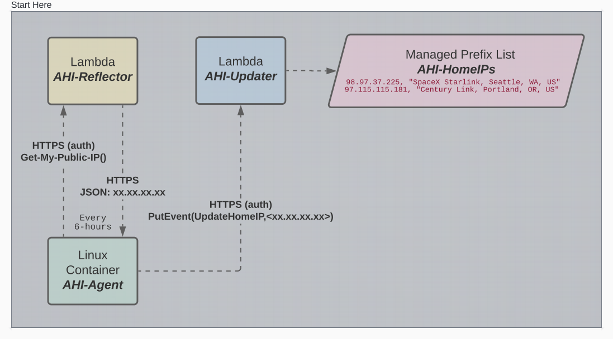
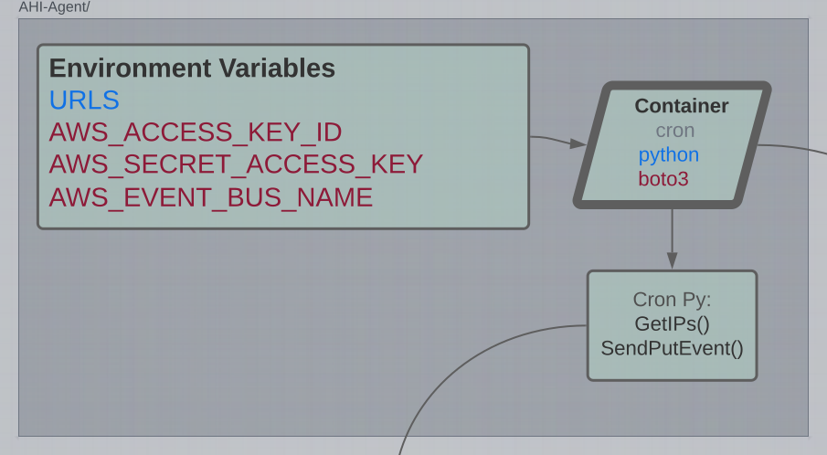

# AWSHomeIP
Automatically keep an AWS Managed Prefix List updated with your Home's Public IP address.

## Solution Components
- **AHI-Agent:** Docker Container that runs a script on a schedule.
- **AHI-Updater:** AWS infrastructure that recieves updates from the AHI-Agent and updates a Managed Prefix List, which can be used in your Security Groups.
- **AHI-Reflector:** AWS infrastructure Used by the AHI-Agent to learn the Home's Public IP addresses.



## Related Projects
- The **AHI-Updater** and **AHI-Reflector** AWS infrastructure components are deployed using Terraform Cloud.
- Terraform configuration is based on the 2env/2region template provided in https://github.com/singlekorn/aws-1korn
    - *Terraform Cloud Workspaces* for this template can be deployed using https://github.com/singlekorn/tfc-singlekorn

# AHI-Agent
This component is a Docker Container found in the ./ahi-agent directory.

- Run this container on your home network.
- **For multiple public IPs:** Use multiple public AHI-Reflectors if you have multiple public IP addresses for your home network (1 for each ISP) .
    - *Your home network should be configured to use a different ISP for each AHI-Reflector URL* 
    - Example: 
        - Home firewall is configured so traffic to the first URL, `api.ipify.org`, uses only the first ISP.
        - Home firewall is configured so traffic to the second URL, `www.l2.io`, uses only the second ISP.

- Supply the container with some Environment Variables:
    - `URLS` is a comma seperated list of the AHI-Reflector public URLs (you need to deploy AHI-Reflector first)
    - `AWS_EVENT_BUS_NAME` is the name of the AWS EventBridge Bus where this container sends its updates
    - `AWS_ACCESS_KEY_ID` and `AWS_SECRET_ACCESS_KEY` are used by the container to authenticate to AWS to allow AWS PutEvent API calls ()
    ```
    URLS=https://api.ipify.org/?format=json,https://www.l2.io/ip.json
    AWS_ACCESS_KEY_ID=<>
    AWS_SECRET_ACCESS_KEY=<>
    AWS_EVENT_BUS_NAME=AHI
    ```

## Docker Summary
- Base Image: `python:3.11-rc-alpine`
- Add `boto3`
- Use Cron to run the `ahi-agent.py` script every 6-hours



## ahi-agent.py Summary

- Get Public IPs from AHI-Reflector URLs
    - Using a pinned CTL, validate Server Authentication
    - Validate we get 200s, and results are IPv4 Addresses
    - Throw error
- Send Public IPs to AWS EventBridge
    - Create PutEvent payload
    - Send PutEvent
    - Throw error

## Building & Testing
From the /ahi-agent working directory:
```docker build -t ahi-agent:python . && docker run --rm --env-file .env -it ahi-agent:python```
